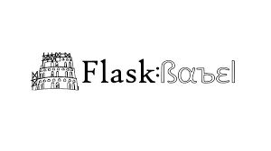

# Internationalization (i18n) in Flask

## Description
This project aims to implement internationalization (i18n) in a Flask application, enabling the display of content in multiple languages based on user preferences or other parameters. By leveraging Flask-Babel and other resources, we will parametrize Flask templates, infer the correct locale, and localize timestamps to create a user-friendly and globally accessible web application.

## Overview
"i18n" is a commonly used abbreviation for "internationalization." The term refers to the process of designing and developing software or products in a way that makes them adaptable to different languages and cultural conventions without requiring significant changes to the underlying codebase.

"L10n" is another common abbreviation used in the context of software development and localization. It stands for "localization. "L10n" involves adapting a product or software to a specific locale or market, including translating text, adjusting cultural elements, and modifying functionality to suit the preferences and requirements of users in that locale. This process ensures that the product feels native to users in different regions, improving user experience and accessibility

## General requirements
- Implement Flask-Babel to enable internationalization in the Flask application.
- Parametrize Flask templates to display content in multiple languages.
- Infer the correct locale based on URL parameters, user settings, or request headers.
- Localize timestamps using Flask-Babel and pytz libraries.
